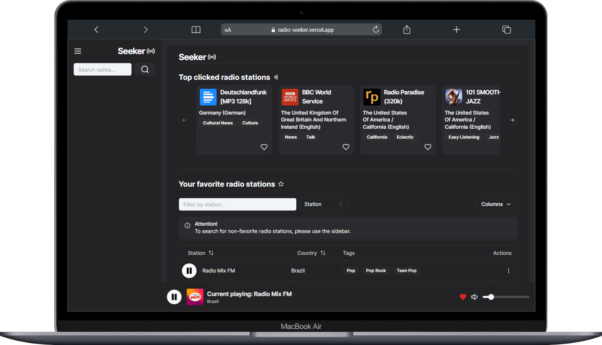
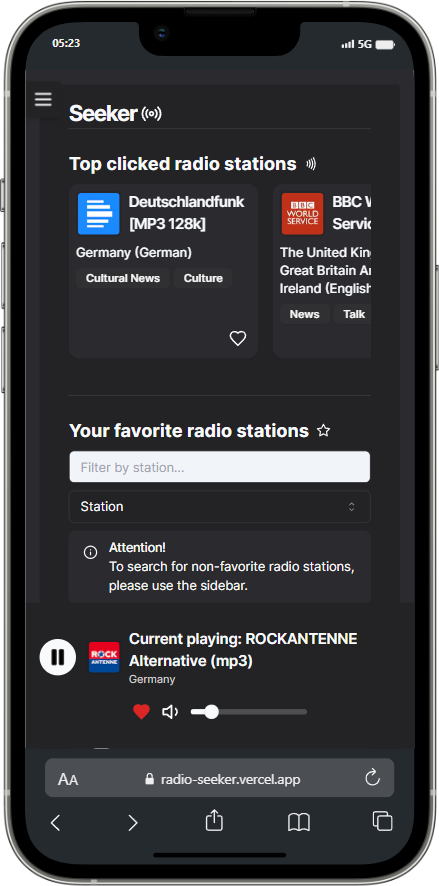

## Projeto: Radio Seeker

  <div align="center" style="margin-bottom: 2em;">
    <div style="display: flex; align-items: center; justify-content: center; gap: 2em; width: 100%;">
      
      
    </div>
  </div>

O projeto é uma aplicação que permite aos usuários pesquisar, adicionar, editar, remover e ouvir estações de rádio online. Com uma interface fácil de usar e funcionalidades práticas, os usuários podem gerenciar suas estações de rádio favoritas com facilidade.

## Tecnologias Utilizadas

- **Linguagem de Programação**:

  - JavaScript

- **Frameworks**:

  - **Next.js**: Versão `14.2.3`, um framework para construção de aplicações React modernas com renderização do lado do servidor e pré-renderização.

- **Tecnologias**:
  - **Bibliotecas de Componentes UI**:
    - **@radix-ui**: Conjunto de bibliotecas para construção de componentes de interface de usuário acessíveis, incluindo:
      - Alert Dialog
      - Dialog
      - Dropdown Menu
      - Icons
      - Label
      - Scroll Area
      - Select
      - Slider
      - Slot
      - Toast
      - Tooltip
    - **lucide-react**: Versão `0.376.0`, para ícones SVG React utilizáveis.
  - **Bibliotecas para Formulários e Validação**:
    - **react-hook-form**: Versão `7.51.3`, para gerenciamento de formulários com hooks em React.
    - **@hookform/resolvers**: Versão `3.3.4`, para integração de `react-hook-form` com bibliotecas de validação, como Zod.
    - **zod**: Versão `3.23.6`, para validação de dados.
  - **Estilização**:
    - **tailwindcss**: Versão `3.4.3`, para uma abordagem moderna de CSS com classes utilitárias.
    - **tailwind-merge**: Versão `2.3.0`, para combinar classes do Tailwind CSS.
    - **tailwindcss-animate**: Versão `1.0.7`, para animações com Tailwind CSS.
    - **clsx**: Versão `2.1.1`, para construção de strings de classes de estilo com base em condições.
    - **class-variance-authority**: Versão `0.7.0`, para construção de componentes estilizados com classes variantes.
  - **Bibliotecas para Tabelas e Notificações**:
    - **@tanstack/react-table**: Versão `8.16.0`, para criar tabelas complexas e personalizáveis.
    - **sonner**: Versão `1.4.41`, para exibir notificações ao usuário.

## Como Instalar e Usar o Projeto

### Pré-requisitos

Certifique-se de ter os seguintes pré-requisitos instalados:

- **Node.js**: Versão 14 ou superior.
- **npm** ou **yarn**: Gerenciadores de pacotes para instalar as dependências do projeto.

### Instalação

1. Clone o repositório do projeto para o seu computador:

   ```shell
   git clone https://github.com/jotace-br/radio-seeker.git
   ```

2. Navegue até o diretório do projeto:

   ```shell
   cd radio-seeker
   ```

3. Instale as dependências do projeto:

   ```shell
   npm install
   ```

   Ou, se preferir usar `yarn`:

   ```shell
   yarn install
   ```

### Executar a Aplicação em Desenvolvimento

1. Para iniciar o servidor de desenvolvimento, use o comando:

   ```shell
   npm run dev
   ```

   Ou, se preferir usar `yarn`:

   ```shell
   yarn dev
   ```

   O servidor de desenvolvimento será iniciado e você poderá acessar a aplicação em seu navegador em [http://localhost:3000](http://localhost:3000).

### Compilar a Aplicação para Produção

1. Para compilar a aplicação para produção, use o comando:

   ```shell
   npm run build
   ```

   Ou, se preferir usar `yarn`:

   ```shell
   yarn build
   ```

### Iniciar o Servidor em Produção

1. Após compilar a aplicação, você pode iniciar o servidor de produção com o comando:

   ```shell
   npm start
   ```

   Ou, se preferir usar `yarn`:

   ```shell
   yarn start
   ```

   A aplicação estará disponível em [http://localhost:3000](http://localhost:3000).

Siga essas instruções para instalar, configurar e iniciar o projeto. Caso encontre algum problema, consulte a documentação oficial do Next.js ou abra uma issue no repositório.

### Pré-requisitos

Certifique-se de ter as seguintes dependências instaladas:

- **Node.js**: Versão 14 ou superior.
- **npm** ou **yarn**: Gerenciadores de pacotes para instalar as dependências do projeto.
- **Git**: Para clonar o repositório do projeto.

## .gitignore

O arquivo `.gitignore` é essencial para definir quais arquivos e pastas devem ser ignorados pelo Git. Para um projeto em JavaScript usando Next.js, um arquivo `.gitignore` típico pode incluir:

```plaintext
# Node modules
node_modules/

# Compilados Next.js
.next/

# Arquivos de construção estáticos
out/

# Arquivos de log
*.log

# Sistema operacional específico
.DS_Store
Thumbs.db
```

Inclua essas entradas no seu arquivo `.gitignore` para manter o repositório limpo de arquivos desnecessários.

## Challenge

> This is a challenge by [Coodesh](https://coodesh.com/)

## Link do Repositório

[Radio-Seeker](https://github.com/jotace-br/radio-seeker)
[Projeto com deploy na Vercel](https://radio-seeker.vercel.app/)
